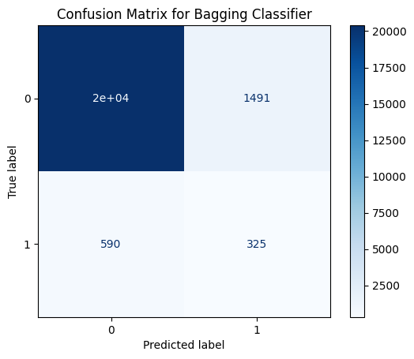
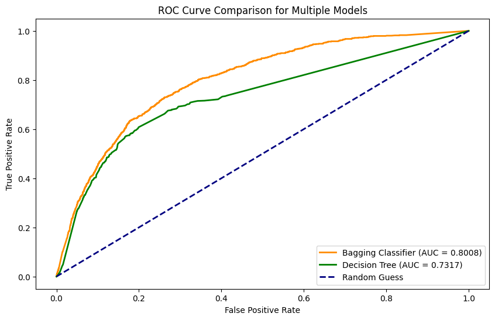
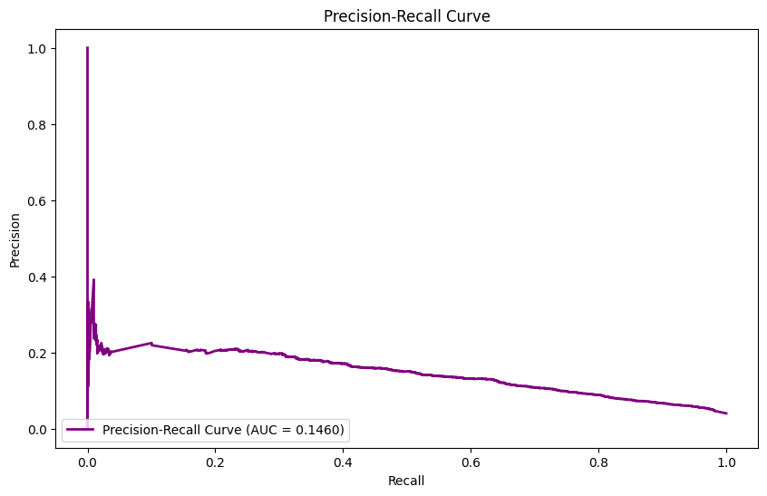

# Santander Customer Satisfaction

[](https://www.python.org/) 
[](LICENSE) 


A machine learning solution for predicting customer dissatisfaction using decision trees, bagging, and SMOTE. This project tackles challenges like class imbalance, noisy features, and model evaluation.
<p align="center">
   
</p>

---

## 📚 Table of Contents

1. [Overview](#-overview)
2. [Setup](#-setup)
3. [Data](#-data)
4. [Project Structure](#-project-structure)
5. [Code Overview](#-code-overview)
6. [Results](#-results)
7. [Limitations](#-limitations)
8. [Future Work](#-future-work)
9. [Acknowledgements](#-acknowledgements)

---

## 🌟 Overview
Predicting customer dissatisfaction is critical for proactive customer retention. This project addresses noisy, imbalanced data using techniques like SMOTE, hyperparameter tuning, and ensemble learning.

### Key Features:
- Preprocessing with SMOTE to balance the dataset.
- Hyperparameter tuning of decision trees.
- Ensemble learning with bagging.
- Detailed evaluation using AUC, precision-recall, and confusion matrices.

---

## ⚙ Setup
### Clone the Repository
```bash
git clone https://github.com/your-username/Santander-Customer-Satisfaction.git
cd Santander-Customer-Satisfaction
```
### Installing Dependencies
To install the required Python packages, run:
```bash
pip install -r requirements.txt
```

---

## 📂 Data

The dataset is from the [Santander Customer Satisfaction Kaggle Competition](https://www.kaggle.com/c/santander-customer-satisfaction/data).

Place the following files in the `data/` folder:
- `train.csv`: Training dataset
- `test.csv`: Test dataset

### Instructions
1. Download the datasets from the Kaggle competition page.
2. Move them to the `data/` folder:
   ```bash
   mv ~/Downloads/train.csv data/
   mv ~/Downloads/test.csv data/

---


## 📂 Project Structure

This repository is organized as follows:

```text
Santander-Customer-Satisfaction/
├── data/
│   ├── train.csv                    # Training dataset
│   ├── test.csv                     # Test dataset
├── images/
│   ├── confusion_matrix.png         # Confusion Matrix visualization
│   ├── roc_curve.png                # ROC Curve comparison
│   ├── precision_recall_curve.png   # Precision-Recall curve
├── notebook/
│   ├── Santander_Analysis_Colab.ipynb # Single Colab notebook for the entire project
├── presentations/
│   ├── Santander_Project_Presentation.pptx  # PowerPoint Presentation
│   ├── Santander_Project_Recording.mp4      # Recording of the project
├── results/
│   ├── predictions.csv              # Submission file
├── LICENSE                          # License for the project
├── README.md                        # Main documentation
├── requirements.txt                 # List of dependencies
```
### Descriptions of Folders and Key Files

- **`data/`**: Folder containing input datasets:
  - `train.csv`: Training dataset.
  - `test.csv`: Test dataset for making predictions.
  - **Note**: If These files are not included in the repository due to size and confidentiality constraints. Please download them from [Kaggle](https://www.kaggle.com/c/santander-customer-satisfaction).
- **`images/`**: Folder for generated plots and visualizations:
  - `confusion_matrix.png`: Confusion Matrix visualization.
  - `roc_curve.png`: ROC Curve comparison between models.
  - `precision_recall_curve.png`: Precision-Recall Curve for imbalanced datasets.
- **`notebook/`**: Contains the single Colab notebook:
  - `Santander_Analysis_Colab.ipynb`: A consolidated Colab notebook including all steps: EDA, model training, evaluation, and submission creation.
- **`presentations/`**: Contains the project presentation and recording:
  - `Santander_Project_Presentation.pptx`: PowerPoint file summarizing the project.
  - `Santander_Project_Recording.mp4`: Walkthrough video explaining the workflow and results.
- **`results/`**: Folder containing final outputs:
  - `predictions.csv`: Submission-ready file with predicted probabilities for the test set.
- **`README.md`**: The main documentation file for the project.
- **`requirements.txt`**: Contains the list of Python libraries and their versions needed to replicate the environment.

---

## 📔 Code Overview

The notebook `Santander_Analysis_Colab.ipynb` contains the following steps:

1. **Data Loading and Exploration:**
   - Loads the training and testing datasets (`data/train.csv` and `data/test.csv`).
   - Performs an exploratory analysis to understand class distributions, missing values, and feature statistics.

2. **Data Preprocessing:**
   - Applies techniques like SMOTE to balance the dataset due to class imbalance.
   - Performs feature selection and scaling to improve model performance.

3. **Model Training and Tuning:**
   - Implements and trains a Decision Tree classifier.
   - Conducts hyperparameter tuning using Grid Search to optimize parameters like max depth and split criteria.

4. **Model Evaluation:**
   - Evaluates the models using metrics such as:
     - **ROC-AUC**
     - **Precision-Recall Curve**
     - **Confusion Matrix**
   - Compares results between models, such as Bagging Classifier vs. Decision Tree.

5. **Visualizations:**
   - Plots key visualizations to aid interpretation:
     - Confusion Matrix
     - ROC Curve Comparison
     - Precision-Recall Curve

6. **Results and Predictions:**
   - Saves the predictions as `results/submissions.csv` for final submission.
   - Highlights model performance using metrics like AUC and Precision-Recall.

---

## 📊 Results

The following table summarizes the performance of the key models:

| Model                     | AUC Score | Precision | Recall | F1-Score |
|---------------------------|-----------|-----------|--------|----------|
| Base Decision Tree        | 0.553     | 0.17      | 0.35   | 0.24     |
| Bagging Classifier        | 0.8008    | 0.16      | 0.44   | 0.23     |
| SMOTE + Class Weights     | 0.8034    | 0.15      | 0.44   | 0.23     |

---

### Visualizations

#### **1. Confusion Matrix**
The confusion matrix shows the model's classification results:



#### **2. ROC Curve Comparison**
This plot compares the ROC curves for different models:



#### **3. Precision-Recall Curve**
This curve highlights the trade-offs between precision and recall:



---

## ⚠ Limitations

While this project achieved its goals, there are several limitations:

1. **Class Imbalance**:
   - The dataset contains significantly fewer positive labels (dissatisfied customers) compared to negative ones.
   - This imbalance required techniques like SMOTE, which introduces synthetic data and may not perfectly replicate real-world distributions.

2. **Feature Noise**:
   - Many features had low variance or weak correlation with the target variable, leading to challenges in feature selection and increased computation time.

3. **Model Metric Sensitivity**:
   - The models optimized for AUC may not perform as well on precision-recall trade-offs, which are critical in real-world applications where false positives are costly.


---

## 🚀 Future Work

This project opens up several avenues for further exploration:

1. **Experiment with Advanced Models**:
   - Use ensemble methods like Gradient Boosting (e.g., XGBoost, LightGBM) or neural networks to capture more complex relationships in the data.
   - Investigate the impact of stacking multiple models.

2. **Feature Selection and Engineering**:
   - Explore advanced feature selection methods such as SHAP values or Recursive Feature Elimination (RFE) to identify the most influential features.
   - Engineer new features based on domain knowledge or interactions between variables.

3. **External Data Integration**:
   - Incorporate external data sources (e.g., customer transaction history, demographics) to improve predictive accuracy and provide a richer context.

4. **Hyperparameter Tuning**:
   - Expand hyperparameter tuning using advanced techniques like Bayesian optimization to find the optimal model configurations.

5. **Model Deployment**:
   - Develop a REST API using Flask or FastAPI to deploy the final model for real-world integration into customer feedback systems.


---

## 🙏 Acknowledgements

- Dataset: [Santander Customer Satisfaction Kaggle Competition](https://www.kaggle.com/c/santander-customer-satisfaction)
- Libraries Used:
  - [Scikit-learn](https://scikit-learn.org/)
  - [Imbalanced-learn](https://imbalanced-learn.org/)
  - [Matplotlib](https://matplotlib.org/)
  - [Pandas](https://pandas.pydata.org/)
  - [NumPy](https://numpy.org/)

Special thanks to Kaggle for hosting the competition and providing the dataset.

